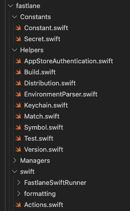

Fastlane is a part of the automation tool for the development and release process of the project. This document will mention some crucial parts of the pipeline.



## Fastfile

### Build and test

The lane `build_and_test` helps build and test the application with the configuration of the test scheme and test target defined in the `Constants.rb` file.

Example:

```
$ bundle exec fastlane build_and_test
```

After running this lane, it is able to generate the code coverage report.

> See more:
> 
> - [Constants.rb](#constantsrb)

### Synchronize the provisioning profile

As the developer team has many developers, it is recommended to synchronize the certificates and profiles across the team during the development process.

The `fastlane match` is here for sharing one code signing identity across the development team to simplify the codesigning setup and prevent code signing issues.

To synchronize the machine with the certificate and profiles which is stored in a match repository, please use the following lanes:

| `sync_development_signing` | `sync_adhoc_signing` | `sync_adhoc_production_signing` | `sync_appstore_signing` |
|---|---|---|---|
| Synchronize with the development distribution. | Synchronize with the Ad Hoc distribution for the Staging build. | Synchronize with the Ad Hoc distribution for the Production build. | Synchronize with the App Store Connect distribution. |


Example:

```
$ bundle exec fastlane sync_development_signing
$ bundle exec fastlane sync_adhoc_signing
$ bundle exec fastlane sync_adhoc_production_signing
$ bundle exec fastlane sync_appstore_signing
```

### Register a new device

To register a new device and synchronize the new device across the development team, use the lane `register_new_device` and provide the device UDID along with the device name:

Example:

```
$ bundle exec fastlane register_new_device
```

### Build and upload the application

So as to build and upload the application to distribution tools, like Firebase or App Store Connect, please use these lanes:

| `build_and_upload_staging_app` | `build_and_upload_production_app` | `build_and_upload_appstore_app` |
|---|---|---|
| To upload the Staging build and Staging dSYM file to Firebase. | To upload the Production build and Production dSYM file to Firebase. | To upload the Production build to App Store and Testflight. |

Example: 

```
$ bundle exec fastlane build_and_upload_staging_app
$ bundle exec fastlane build_and_upload_production_app
$ bundle exec fastlane build_and_upload_appstore_app
```

> See more:
> 
> - [Gymfile](#gymfile)
> - [BuildManager.rb](#buildmanagerrb)
> - [DistributionManager.rb](#distributionmanagerrb)


## Matchfile

Define the basic information to synchronize the certificates and profiles across the development team.

> See more:
> 
> - [MatchManager.rb](#matchmanagerrb)
> - [Synchronize the provisioning profile](#synchronize-the-provisioning-profile)

## Gymfile

Store defaults parameters when triggering a new build.

## Constants folder

### Constants.rb

Contains the key/value pairs of constants that will be used during the development and release process.

### Environments.rb

Contains the key/value pairs of environment variables that will be used during the development and release process.

## Managers folder

### BuildManager.rb

The `BuildManager` helps build and sign the application. There are two main functions:

| `build_ad_hoc` | `build_app_store` |
|---|---|
| Build and sign the application with the `ad-hoc` distribution. | Build and sign the application with the `app-store` distribution. |

> See more:
>
> - [Build and upload the application](#build-and-upload-the-application)

### DistributionManager.rb

The `DistributionManager` is in charge of distributing the build to the distribution tools, such as Firebase, App Store Connect, and Testflight.

> See more:
>
> - [Build and upload the application](#build-and-upload-the-application)

### MatchManager.rb

The responsibility of `MatchManager` is to synchronize the certificates and profiles across the team during the development process.

> See more:
>
> - [Synchronize the provisioning profile](#synchronize-the-provisioning-profile)
> - [Matchfile](#matchfile)

### SymbolManager.rb

Technically, the debug Symbol file (dSYM file) is used to de-obfuscate stack traces from crashes happening on the production app. The dSYM files store the debug symbols for the application. Then services (like Crashlytics) use the dSYM files to replace the symbols in the crash reports with the originating locations in the source code. Hence, the crash reports will be more readable and understandable.

The `SymbolManager` helps process and upload dSYM file to Firebase. There are two main functions:

| `upload_built_symbol_to_firebase` | `download_processed_dsym_then_upload_to_firebase` |
|---|---|
| Directly upload the built dSYM file to Crashlytics. | Download the processed dSYM file from App Store Connect, then upload it to Crashlytics. |
|  It is recommended to use this function when the build configuration is `Release Staging`. | It is recommended to use this function when the build configuration is `Release Production`. |
| See more: [Debug Symbol File](Project-Configurations.md#debug-symbol-file) | See more: [Debug Symbol File](Project-Configurations.md#debug-symbol-file) and [Enable Bitcode](Project-Configurations.md#enable-bitcode) |

### TestManager.rb

The `TestManager` helps build and test the application.

### VersioningManager.rb

The `VersioningManager` manages the build number and version number of the application.