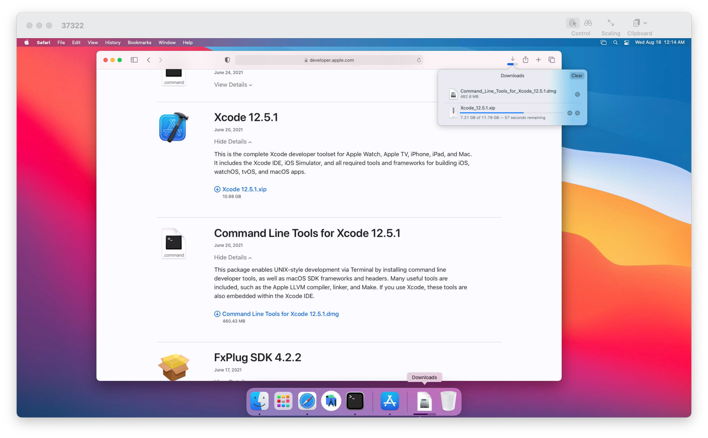
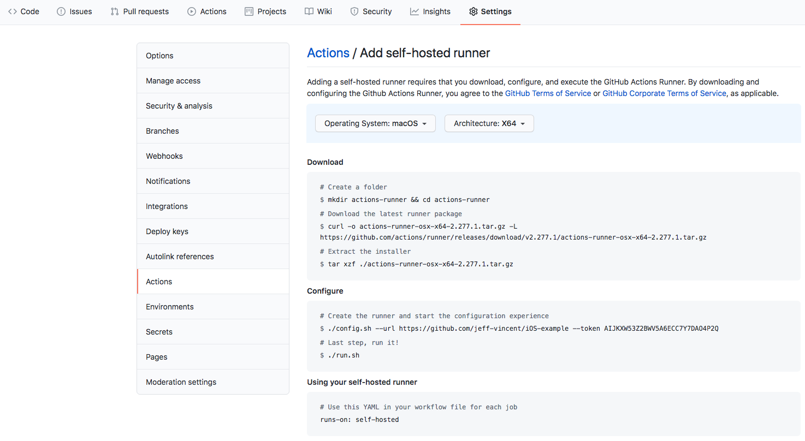

# Github Actions Self-Hosted Runner

## Problem

While Github Actions is being used on some iOS projects, the CI pipeline is not running on all pull requests because of the high pricing of runner minutes for iOS. So to support running the CI pipeline on all pull requests, we decide to use self-hosted runners with Github Actions.

## Host

### Self-Hosted Runner

GitHub Actions allows developers to set up a self-hosted runner in place of a Github-provided runner. A self-hosted runner can be either a local or cloud device.

### Local Hosted Runner

Existing macOS devices can be used to run Github Actions Workflow by installing the runner and having the machine listen to the command from Github Actions.

### Remote/Rental Hosted Runner

These are remote computers, available to use as infrastructure-as-a-service or platform-as-a-service. They are more suitable to host the Github Actions runner as they are guaranteed to be online (as per the service’s terms). Covered in this guide is as [MacStadium](http://macstadium.com/). Other services include:

- [https://aws.amazon.com/ec2/instance-types/mac/](https://aws.amazon.com/ec2/instance-types/mac/)
- [http://www.macincloud.com/](http://www.macincloud.com/)

## MacStadium Set Up

A freshly rented MacStadium does not include all the tools needed to start a GitHub Actions for iOS development. 

To install all the dependencies, follow these required steps:

1. Download Xcode and Xcode Command Line Tool from [https://developer.apple.com/xcode/](https://developer.apple.com/xcode/)
    
    
    
2. Launch `Terminal` to install Ruby with `gem update --system`. The current version used for writing this document is `gem install bundler:2.2.15`.
3. Connect Github Actions Runner to the machine.
4. Trigger a run from Github Console or git push.
5. During the first Github Actions runtime, some gems package will require machine password to install. This is referred to machine password in MacStadium when setting up the Mac.

## Connect Github Actions Runner

The instruction for connecting Github Actions to the hosting machine should follow the instruction found in `Settings > Actions > Runners > New self-hosted runner` in the projects repository page.

The general steps are:

1. Download: Download the newest version of Github Runner and save in the runner folder.
2. Configure: Inject the project’s token to the runner and run the executable.

## Add More Runners

To add more runners to the same or a new host, simply follow the instruction from the repository’s settings `Settings > Actions > Runners > New self-hosted runner`. Make sure the new runner is downloaded onto a separate folder.

## Restarting Runner

In the case that the machine is shut down or the terminal running the script was exited, the runner script can be relaunched by `cd` to the script folder and run `./run.sh`.

## Result

When setting up successfully.

