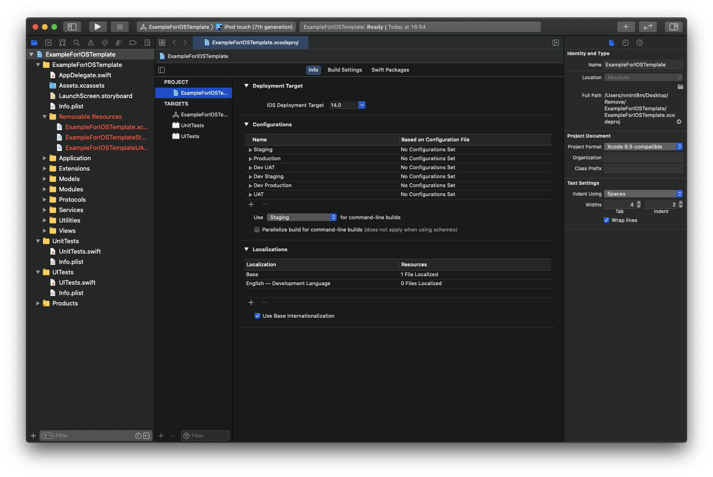
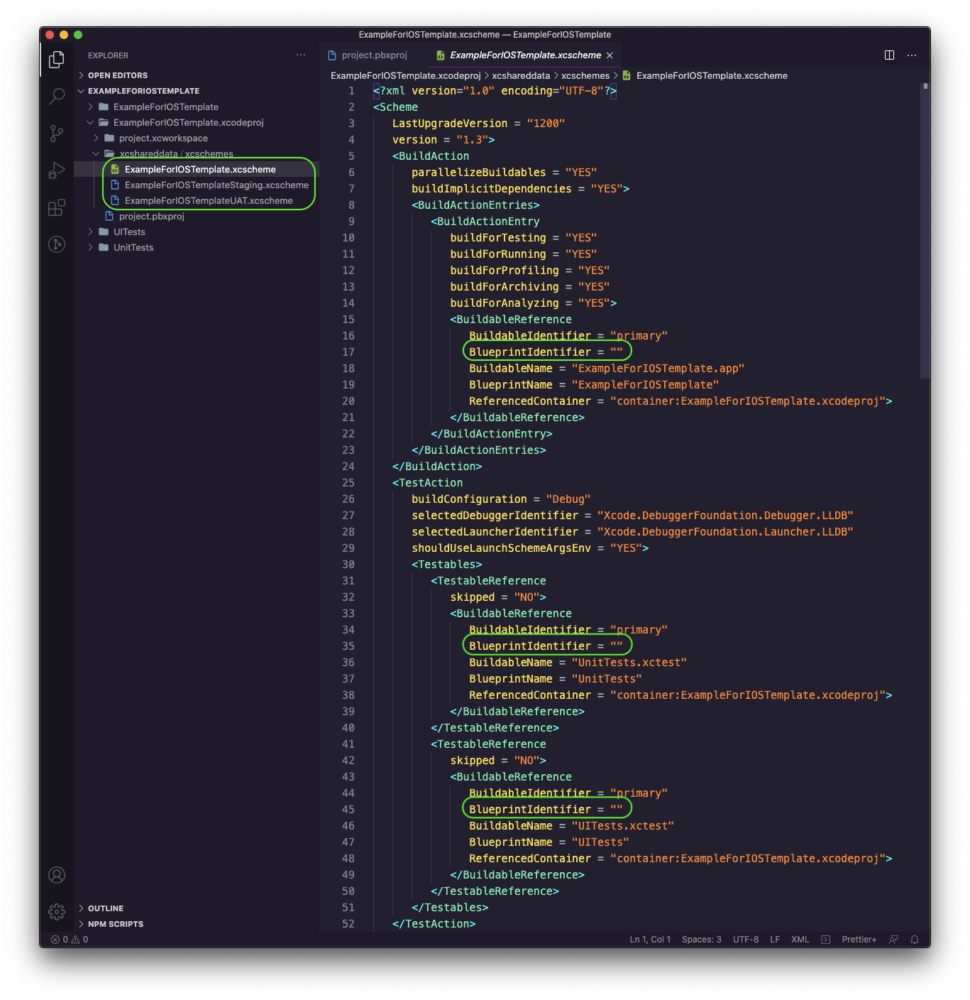
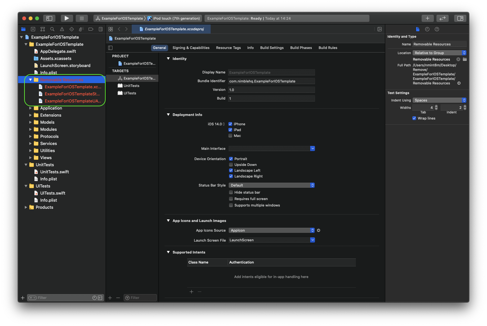

# ios-template
Our optimized iOS template used in our projects using Xcode Templates

## Requirements

Xcode 12.0

## Usage

Add Nimble's templates by placing them in the folder `~/Library/Developer/Xcode/Templates/` by running this script

```sh
$ bash install.sh
```

## Wiki

1. [Standard File Organization](https://github.com/nimblehq/ios-templates/wiki/Standard-file-organization)
2. [Project Configurations](https://github.com/nimblehq/ios-templates/wiki/Project-configurations)

## Known Issues

### Configurations

After creating project, when we go to Project's Info tab, there are two default configurations:

- `Debug`
- `Release`

We have to close and reopen project in Xcode to reveal all 6 custom configurations and 2 default configurations.


Because we do not use the default configutations (`Debug` and `Release`) any more. So we should manually remove them. Open `Project` > Tab `Info` and remove unecessary configuration.



### Schemes

After you initialize the project with this template, you should do two following steps to fulfill the scheme's settings:

- Firstly, fill blueprint identifiers with the associated targets' UUID.
- Secondly, remove the folder `Removable Resources`.

Open files `*.xscheme` in `{{ProjectName}}.xcodeproj/xshareddata/xschemes/`. As you can see, the `BlueprintIdentifier` fields are left with empty value.



Let's take a look into `project.pbxproj`, there are 3 targets defined with their UUID:

- `{{ProjectName}}`
- `UnitTests`
- `UITests`


So as to specify right the target for scheme to run:

- Fill the target `UnitTests`'s UUID for the TestAction Unit Tests
- Fill the target `UITests`'s UUID for the TestAction UI Tests
- Fill the target `{{ProjectName}}`'s UUID for the others

The last step is to remove the red named folder `Removable Resources`.


