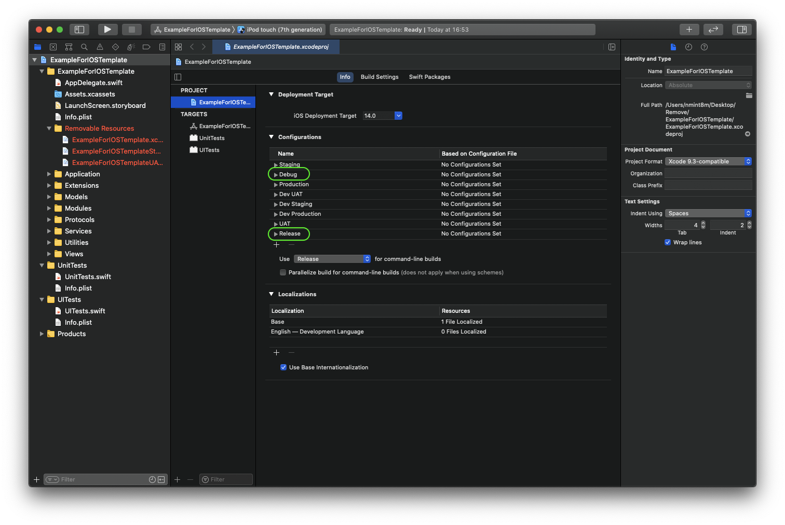
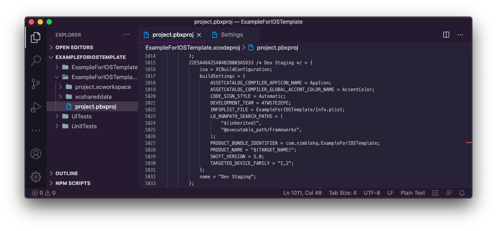
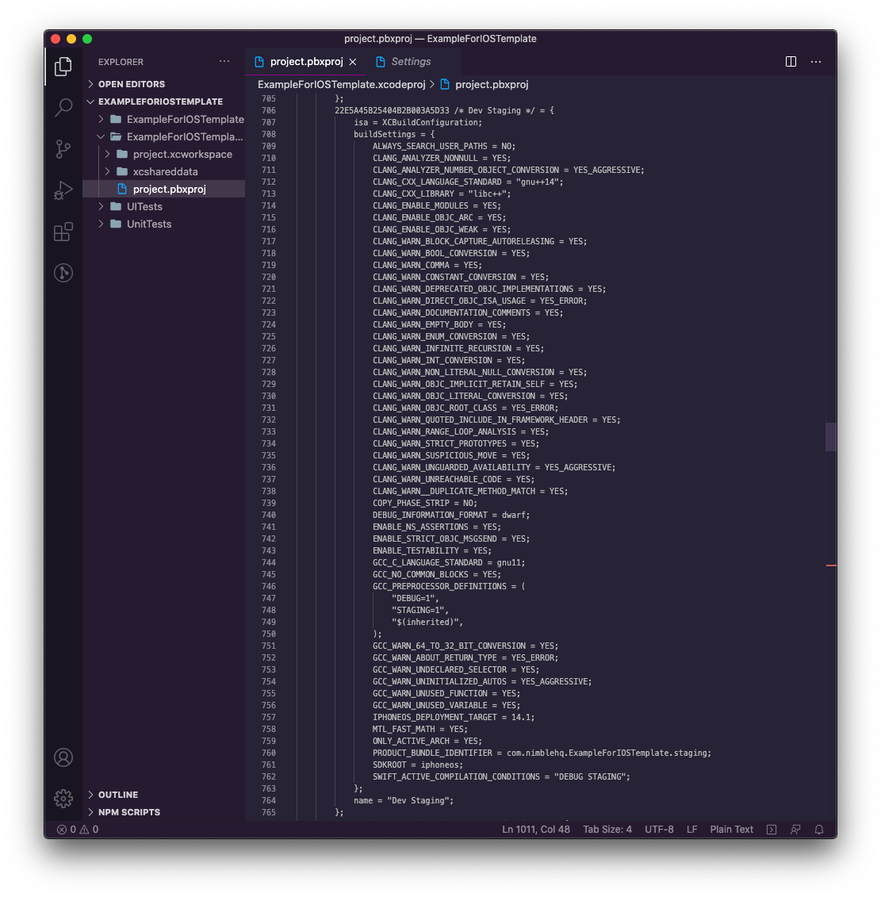
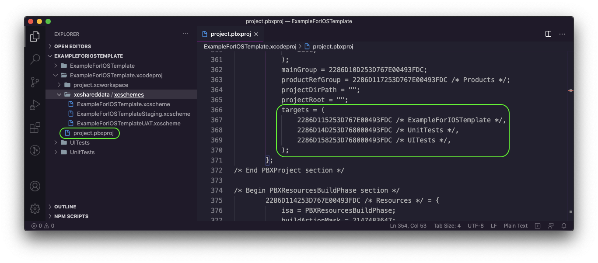

# ios-template

Our optimized iOS template used in our projects using Xcode Templates

## Requirements

Xcode 12.0

## Installation

**macOS**

- Clone the repo into `tmp` folder
```sh
cd /tmp && git clone https://github.com/nimblehq/ios-templates.git
```
- Run `install.sh` script
```sh
bash ios-templates/install.sh
```
- Setup git hooks for a project
```
bash install.sh githooks [path_to_project]
```

## Wiki

1. [Standard File Organization](https://github.com/nimblehq/ios-templates/wiki/Standard-file-organization)
2. [Project Configurations](https://github.com/nimblehq/ios-templates/wiki/Project-configurations)
3. [Why having project's dependencies](https://github.com/nimblehq/ios-templates/wiki/Why-having-project%27s-dependencies)
4. [Code Snippets](https://github.com/nimblehq/ios-templates/wiki/Code-Snippets)

## Known Issues

### Configurations

After creating project with this template, when we go to Project's Info tab, there are two default configurations:

- `Debug`
- `Release`

What you have to do is close and reopen project with Xcode. This time you can reveal all 6 custom configurations and 2 default configurations.



Because you will not use the default configutations (`Debug` and `Release`) any more. So we should manually remove them. Open `Project` > Tab `Info` and remove unecessary configuration.

- `Dev Staging`
- `Staging`
- `Dev UAT`
- `UAT`
- `Dev Production`
- `Production`


One more thing there are some duplicated build settings stored in the file `project.pbxproj`. Some of them are automatically initialized and some are customized. For an instance, the build setting `PRODUCT_BUNDLE_IDENTIFIER` for `Dev Staging` is duplicated.

| Default                                                      | Custom                                                       |
| ------------------------------------------------------------ | ------------------------------------------------------------ |
|  |  |

What we should do is to remove all duplicated settings for all build configurations.

The following list is the default initialized settings that you should remove:

- `PRODUCT_BUNDLE_IDENTIFIER`
- `PRODUCT_NAME`

> Note:
>
> - Check the `Debug`/`Release` build configurations are completely remove out of the file `project.pbxproj`

### Schemes

After you initialize the project with this template, you should do two following steps to fulfill the scheme's settings:

- Firstly, fill blueprint identifiers with the associated targets' UUID.
- Secondly, remove the folder `Removable Resources`.

Open files `*.xscheme` in `{{ProjectName}}.xcodeproj/xshareddata/xschemes/`. As you can see, the `BlueprintIdentifier` fields are left with empty value.


Let's take a look into `project.pbxproj`, there are 3 targets defined with their UUID:

- `{{ProjectName}}`
- `UnitTests`
- `UITests`



So as to specify right the target for scheme to run:

- Fill the target `UnitTests`'s UUID for the TestAction Unit Tests
- Fill the target `UITests`'s UUID for the TestAction UI Tests
- Fill the target `{{ProjectName}}`'s UUID for the others

The last step is to remove the red named folder `Removable Resources`.


